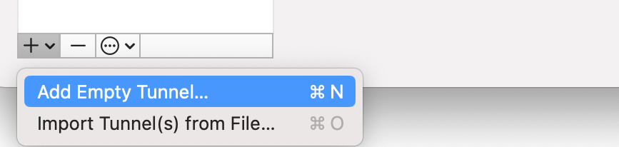
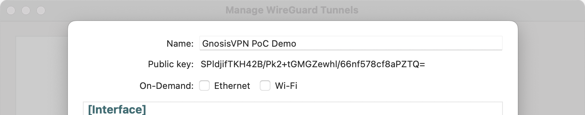
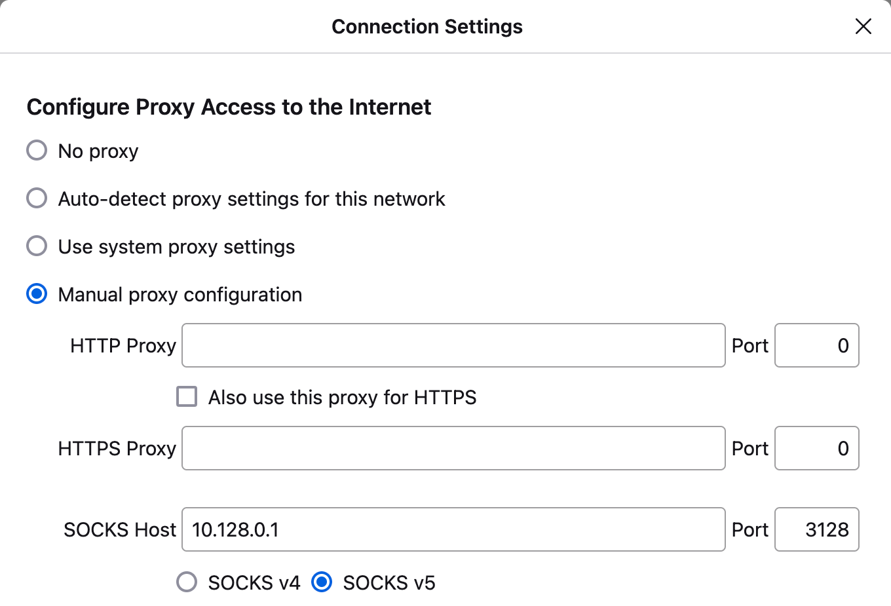
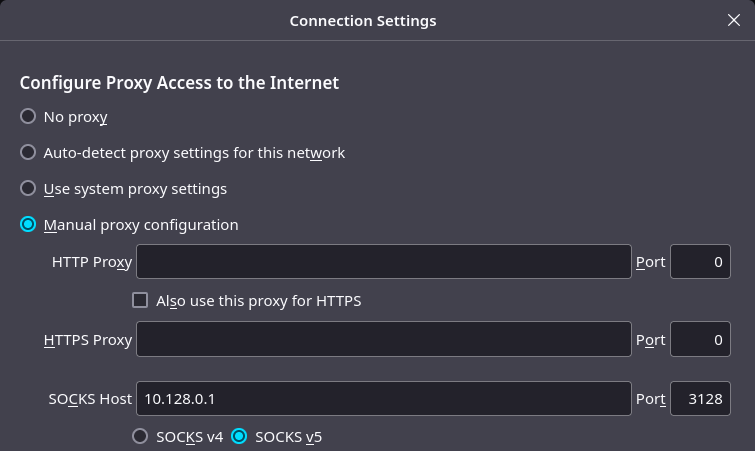

# Onboarding

The Gnosis VPN proof of concept is a work in progress and may be updated at any time. It may therefore be unstable or contain bugs, and should not be used in situations which require full anonymity. Use at your own risk. To manage load and aid with testing and debugging, an allow list of sites is currently enforced. The full allow list can be viewed at the [servers page](https://gnosisvpn.com/servers#allowlist). For testing and debugging, exit nodes currently gather logs. These logs cannot reveal user requests, server responses, IPs or any other identifying information to Gnosis Ltd or any other party. Logs are deleted after thirty days.

The software is licensed under the GNU Lesser General Public License v3.0 and may be freely used, modified and distributed in accordance with the license terms. Users should check local laws before using the PoC (including operating a relay node). Users are solely responsible for how they use and interact with the PoC, and for complying with applicable laws. The PoC should not be used for illegal, malicious or unethical purposes.

The following 12 step process will guide you through these topics:

- **Manually prepare** and configure a WireGuard interface on top of your GnosisVPN connection.
- **Configure your hopd node** to allow a GnosisVPN connection.
- **Configure GnosisVPN client** using information from three separate sources:
  1. Your hoprd node credentials
  2. Your assigned WireGuard IP
  3. Your chosen exit location
- **Download the binary file** and run it with several env var parameters.
- **Configure Firefox proxy settings** to use the GnosisVPN connection.
- **Leave feedback** by filling out the [feedback form](https://cryptpad.fr/form/#/2/form/view/ID9xmo4wYOdM4ZOzCiVMf5w6ZJehzNaIC53gkNS6C+k/).

Having trouble with the PoC? Check out the [FAQ](FAQ.md).

For any questions or assistance, feel free to join the: [GnosisVPN Discord support channel](https://discord.com/channels/502416149343109121/1337126805995262093).

Please select your operating system to begin:

- [Instructions for macOS](#instructions-for-macos)
- [Instructions for Linux](#instructions-for-linux)

---

## Instructions for macOS

### 1. Generate Wireguard public key [macOS]

1. Download the [WireGuard app](https://apps.apple.com/us/app/wireguard/id1451685025) from the Mac App Store.
2. Launch WireGuard, create an **Empty tunnel**, name it, and save.
   
3. Copy the public key of the newly created tunnel.
   

### 2. Prepare a feedback channel to receive your WireGuard IP [macOS]

Create a secure input location where you will receive your assigned WireGuard IP.

1. Go to [rentry.co](https://rentry.co/).
2. In the text field, enter the public key for your recently created WireGuard tunnel.
3. Locate "Custom url" input field and enter your desired text (e.g., `toms-feedback-gvpn`). Leave the "Custom edit code" field empty. Click on "Go". An edit code will be generated automatically.
4. Save the generated URL from the browser's address bar (e.g., `https://rentry.co/toms-feedback-gvpn`).
5. Note the edit code at the top for the next step.

### 3. Register for GnosisVPN PoC demo [macOS]

Provide your

- Wireguard tunnel public key
- **rentry.co** URL
- **rentry.co** edit code

in our [onboarding form](https://cryptpad.fr/form/#/2/form/view/xCsBTw3vv4fD8Dz3-IMGWwcUnjjNNy5j4-f6Q1xmlxo/).
If you have trouble opening cryptpad, please try to open it in incognito mode.

### 4. Wait until your GnosisVPN user account is created [macOS]

After someone picked up your public key and added it to our WireGuard servers you will find your assigned WireGuard IP at your **rentry.co** document.
You will have to check your **rentry.co** document yourself after a reasonable amount of time.

### 5. Configure your hoprd node to allow GnosisVPN connections [macOS]

GnosisVPN will create UDP connection to your hoprd node on a specified port (e.g.: `1422`).

Treat this as an additional port for hoprd that needs the same treatment as the peer-to-peer port and API port.
If you set up any firewall rules or [port forwarding](https://docs.hoprnet.org/node/port-forwarding) for those ports you will need to do the same for GnosisVPN port.

Additionally you need to configure your hoprd node to allow GnosisVPN connections.
The usual way of running horpd is in a docker container.
This means you need to configure docker to forward that port.

Depending on your setup this can be done in different ways.

#### Hoprd for Docker [macOS]

Update the `hoprd` run command to inlude the port forwarding: `docker run ... -p 1422:1422/udp ...`.

#### Hoprd for Docker Compose [macOS]

Locate `docker-compose.yaml` update update the `ports:` section of `hoprd:`:

```yaml
services:
  hoprd:
    ...
    ports:
      ...
      - "1422:1422/udp"
```

#### Hoprd for Dappnode [macOS]

1. Connect to your Dappnode.
2. Navigate to the **HOPR package**.
3. Go to the **Network** tab and locate the **Public Port Mapping** section.
4. Add a new port entry by clicking on **New port +**.
5. Configure the following settings:

- **HOST PORT**: `1422`
- **PACKAGE PORT NUMBER**: `1422`
- **PROTOCOL**: Select **UDP**.

6. Click **Update Port Mappings** to save your changes.
7. Ensure you configure port-forwarding on your router to expose the REST API port `3001` and the UDP port `1422` to the internet.

### 6. Configure GnosisVPN client - hoprd node [macOS]

1. Create a folder in your home directory called `gnosisvpn-poc`.
2. Download the [config.toml file](./config.toml) and move it into that folder.
3. Edit the `config.toml` and locate the `[hoprd_node]` section to adjust these values:

```toml
[hoprd_node]
endpoint = "http://<hoprd node ip>:<hoprd node API port>"
api_token = "<hoprd node API token>"

internal_connection_port = 1422
```

- `endpoint` is the URL (including port) pointing to the API access of your node (e.g., `http://192.168.0.89:3001`).
- `api_token` is the API access token of your node.
- `internal_connection_port` is the static UDP port which you configured in step 5.

### 7. Configure GnosisVPN client - exit location [macOS]

Visit [GnosisVPN servers](https://gnosisvpn.com/servers) and choose an exit location.
Copy the settings into your `config.toml`:

```toml
[connection]
destination = "<exit node peer id>"

[connection.path]
intermediates = ["<community relayer peer id"]
```

- `destination` is the peer ID of the chosen exit node.
- `intermediates` specifies the community relay node used to establish the connection.

Save and close the configuration file.

### 8. Enable GnosisVPN to establish connections to the Exit Nodes from your hoprd node [macOS]

**Caution:** If you have **channel auto-funding** enabled on your horpd node, you might drain your funds quickly.
To verify this, connect to your node via **Admin UI** of your hoprd node and navigate to the **Configuration** page.
Look at the **Strategies** section and ensure that `!AutoFunding` is **absent**.

**Important Note:** Currently GnosisVPN can only establish connections through high-profile relay nodes maintained by the community.
To use GnosisVPN, you must have an open payment channel from your entry node to the relayer node associated with your chosen exit node.
Relay node address can be found on the [GnosisVPN servers](https://gnosisvpn.com/servers) page.

#### Steps to Open a Payment Channel [macOS]

1. Connect to your node via **Admin UI** of your hoprd node.
2. Navigate to the **PEERS** page.
3. Search for the peer you’ve chosen as a relayer node from [GnosisVPN servers](https://gnosisvpn.com/servers).
4. Click on **OPEN outgoing channel**.
5. Enter funding amount (recommended: **15 wxHOPR**) and click **Open Channel**.
6. Once the channel is successfully opened, it will appear under the **CHANNELS: OUT** page.

### 9. Download the latest binary file [macOS]

Download the latest GnosisVPN binary file for your system by visiting the [GitHub releases](/../../releases/latest) page.
Choose the binary file that matches your system:

| System                | Binary file                 |
| --------------------- | --------------------------- |
| macOS with ARM chip   | `gnosis_vpn-aarch64-darwin` |
| macOS with Intel chip | `gnosis_vpn-x86_64-darwin`  |

Ignore the `*-ctl-*` sibling files.
We do not need them for now.

Move the downloaded binary into your `gnosisvpn-poc` folder next to your `config.toml`.
In the following steps, we assume you downloaded `gnosis_vpn-aarch64-darwin` to keep the instructions consistent.

### 10. Launch the GnosisVPN binary file [macOS]

1. Make the downloaded binary executable by running the following command in your terminal:

```bash
chmod +x ~/gnosisvpn-poc/gnosis_vpn-aarch64-darwin
```

2. Provide the path to your configuration file and launch the GnosisVPN binary file.

```bash
sudo GNOSISVPN_CONFIG_PATH=~/gnosisvpn-poc/config.toml ~/gnosisvpn-poc/gnosis_vpn-aarch64-darwin
```

3. Because of macOS security settings, you will see a message that says binary file “cannot be opened because the developer cannot be verified”.
   Click "Cancel" or "Done", then open System Settings → Privacy & Security, scroll down to Security, and find the blocked binary file. Click "Allow Anyway".

4. In your terminal, run the command to start the binary file again. macOS will prompt you one more time to confirm if you want to open it. Click "Open" or "Open anyway".

If you see immediate errors on startup it is most likely due to errors in your configuration settings.
The logs tell you which setting parameter might be wrong.

### 11. Update the newly created WireGuard tunnel and launch WireGuard [macOS]

In the WireGuard app, edit the tunnel you created.
Leave existing content including the **PrivateKey** as is and paste this additional content as marked in the comments.
Replace placeholders `<...>` with the actual values as documented.

```conf
# Leave this content as is in your tunnel configuration
[Interface]
PrivateKey = <Generated automatic by WireGuard app>

# NOTE: Copy paste from here
ListenPort = 51820
Address = <WireGuard IP> # received via **rentry.co** document, e.g.: 10.128.0.5/32

[Peer]
PublicKey = <wg server pub key> # listed on https://gnosisvpn.com/servers
Endpoint = <hoprd node IP:1422> # port needs to match your `internal_connection_port` configuration
AllowedIPs = 10.128.0.0/9
PersistentKeepalive = 30
```

Now you can activate this interface to establish a connection.

### 12. Use GnosisVPN connection to browse the internet [macOS]

For now we only allow SOCKS v5 proxy connections tunneled through GnosisVPN.
The easiest way to do this is to change the Firefox proxy settings.

1. Open Network Connection Settings by navigating into Settings → General → Network Settings or search "proxy" in the settings search bar and click on the "Settings" button.
2. Choose manual proxy configuration and enter:

- SOCKS Host: `10.128.0.1`
- Port: `3128`
- Socks v5



3. Click "OK" to save the settings.
   Start browsing [these select sites](https://gnosisvpn.com/servers#allowlist) through GnosisVPN.

---

## Instructions for Linux

### 1. Generate WireGuard keypair [Linux]

1. Make sure you have WireGuard and WireGuard-tools installed on your system.
   See [WireGuard installation guide](https://www.wireguard.com/install/).
2. Follow the key generation guidelines on official [WireGuard documentation](https://www.wireguard.com/quickstart/#key-generation).

Usually:

```bash
wg genkey | tee privatekey | wg pubkey > publickey
```

### 2. Prepare a feedback channel to receive your assigned WireGuard IP [Linux]

Create a secure input location where you will receive your assigned WireGuard IP.

1. Go to [rentry.co](https://rentry.co/).
2. In the text field, enter the public key for your recently created WireGuard tunnel.
3. Locate "Custom url" input field and enter your desired text (e.g., `toms-feedback-gvpn`). Leave the "Custom edit code" field empty. Click on "Go". An edit code will be generated automatically.
4. Save the generated URL from the browser's address bar (e.g., `https://rentry.co/toms-feedback-gvpn`).
5. Note the edit code at the top for the next step.

### 3. Register for GnosisVPN PoC demo [Linux]

1. Prepare your public key for copying:

```bash
$ cat publickey
KruyGvXppZ+P4yktb9NmyDUfeqRcTlbgpH7XhywS4Cw= # sample public key
```

2. Provide your

- public key
- **rentry.co** URL
- **rentry.co** edit code

in our [onboarding form](https://cryptpad.fr/form/#/2/form/view/xCsBTw3vv4fD8Dz3-IMGWwcUnjjNNy5j4-f6Q1xmlxo/).
If you have trouble opening cryptpad, please try to open it in incognito mode.

### 4. Wait until your GnosisVPN user account is created [Linux]

After someone picked up your public key and added it to our WireGuard servers you will find your assigned WireGuard IP at your **rentry.co** document.
You will have to check your **rentry.co** document yourself after a reasonable amount of time.

### 5. Configure your hoprd node to allow GnosisVPN connections [Linux]

GnosisVPN will create UDP connection to your hoprd node on a specified port (e.g.: `1422`).

Treat this as an additional port for hoprd that needs the same treatment as the peer-to-peer port and API port.
If you set up any firewall rules or [port forwarding](https://docs.hoprnet.org/node/port-forwarding) for those ports you will need to do the same for GnosisVPN port.

Additionally you need to configure your hoprd node to allow GnosisVPN connections.
The usual way of running horpd is in a docker container.
This means you need to configure docker to forward that port.

Depending on your setup this can be done in different ways.

#### Hoprd for Docker [Linux]

Update the run command to inlude the port forwarding: `docker run ... -p 1422:1422/udp ...`.

#### Hoprd for Docker Compose [Linux]

Locate `docker-compose.yaml` update update the `ports:` section of `hoprd:`:

```yaml
services:
  hoprd:
    ...
    ports:
      ...
      - "1422:1422/udp"
```

#### Hoprd for Dappnode [Linux]

1. Connect to your Dappnode.
2. Navigate to the **HOPR package**.
3. Go to the **Network** tab and locate the **Public Port Mapping** section.
4. Add a new port entry by clicking on **New port +**.
5. Configure the following settings:

- **HOST PORT**: `1422`
- **PACKAGE PORT NUMBER**: `1422`
- **PROTOCOL**: Select **UDP**.

6. Click **Update Port Mappings** to save your changes.

### 6. Configure GnosisVPN client - hoprd node [Linux]

1. Create a folder in your home directory called `gnosisvpn-poc`.
2. Download the [config.toml file](./config.toml) and move it into that folder.
3. Edit the `config.toml` and locate the `[hoprd_node]` section to adjust these values:

```toml
[hoprd_node]
endpoint = "http://<hoprd node ip>:<hoprd node API port>"
api_token = "<hoprd node API token>"

internal_connection_port = 1422
```

- `endpoint` is the URL (including port) pointing to the API access of your node (e.g., `http://192.168.0.89:3001`).
- `api_token` is the API access token of your node.
- `internal_connection_port` is the static UDP port which you configured in step 5.

If you like a more extensively documented configuration file try using [documented config](./documented-config.toml).

### 7. Configure GnosisVPN client - exit location [Linux]

Visit [GnosisVPN servers](https://gnosisvpn.com/servers) and choose an exit location.
Copy the settings into your `config.toml`:

```toml
[connection]
destination = "<exit node peer id>"

[connection.path]
intermediates = ["<community relayer peer id"]
```

- `destination` is the peer ID of the chosen exit node.
- `intermediates` specifies the community relay node used to establish the connection.

Save and close the configuration file.

### 8. Enable GnosisVPN to establish connections to the Exit Nodes from your hoprd node [Linux]

**Caution:** If you have **channel auto-funding** enabled on your hoprd node, you might drain your funds quickly.
To verify this, connect to your node via **Admin UI** of your hoprd node and navigate to the **Configuration** page.
Look at the **Strategies** section and ensure that `!AutoFunding` is **absent**.

**Important Note:** Currently GnosisVPN can only establish connections through high-profile relay nodes maintained by the community.
To use GnosisVPN, you must have an open payment channel from your entry node to the relayer node associated with your chosen exit node.
Relay node address can be found on the [GnosisVPN servers](https://gnosisvpn.com/servers) page.

#### Steps to Open a Payment Channel [Linux]

1. Connect to your node via **Admin UI** of your hoprd node.
2. Navigate to the **PEERS** page.
3. Search for the peer you’ve chosen as a relayer node from [GnosisVPN servers](https://gnosisvpn.com/servers).
4. Click on **OPEN outgoing channel**.
5. Enter funding amount (recommended: **15 wxHOPR**) and click **Open Channel**.
6. Once the channel is successfully opened, it will appear under the **CHANNELS: OUT** page.

### 9. Download the latest binary file [Linux]

Download the latest GnosisVPN binary file for your system by visiting the [GitHub releases](/../../releases/latest) page.
Choose the binary file that matches your system:

| system                    | binary file                |
| ------------------------- | -------------------------- |
| linux with x86 chip       | `gnosis_vpn-x86_64-linux`  |
| linux with newer ARM chip | `gnosis_vpn-aarch64-linux` |
| linux with older ARM chip | `gnosis_vpn-armv7l-linux`  |

Ignore the `*-ctl-*` sibling files.
We do not need them for now.

Move the downloaded binary into your `gnosisvpn-poc` folder next to your `config.toml`.
In the following steps we assume you downloaded `gnosis_vpn-x86_64-linux` to keep the instructions consistent.

### 10. Ready to start the GnosisVPN binary file [Linux]

1. Make the downloaded binary executable by running the following command in your terminal:

```bash
chmod +x ~/gnosisvpn-poc/gnosis_vpn-x86_64-linux
```

2. Provide the path to your configuration file and launch the GnosisVPN binary file.

```bash
sudo GNOSISVPN_CONFIG_PATH=~/gnosisvpn-poc/config.toml ~/gnosisvpn-poc/gnosis_vpn-x86_64-linux
```

If you see immediate errors on startup it is most likely due to errors in your configuration settings.
The logs tell you which setting parameter might be wrong.

### 11. Create a wireguard interface to use the established GnosisVPN connection [Linux]

Create a file called `gnosisvpnpoc.conf` inside `/etc/wireguard/` with the following content.
Replace placeholders `<...>` with the actual values as documented.

```conf
[Interface]
PrivateKey = <Generated automatic by WireGuard app>
ListenPort = 51820
Address = <WireGuard IP> # received via **rentry.co** document, e.g.: 10.128.0.5/32

[Peer]
PublicKey = <wg server pub key> # listed on https://gnosisvpn.com/servers
Endpoint = <hoprd node IP:1422> # port needs to match your `internal_connection_port` configuration
AllowedIPs = 10.128.0.0/9
PersistentKeepalive = 30
```

Activate the WireGuard device with `sudo wg-quick up gnosisvpnpoc`.

### 12. Use GnosisVPN connection to browse the internet [Linux]

For now we only allow SOCKS v5 proxy connections tunneled through GnosisVPN.
The easiest way to do this is to change the Firefox proxy settings.

1. Open Network Connection Settings by navigating into Settings → General → Network Settings or search "proxy" in the settings search bar and click on the "Settings" button.
2. Choose manual proxy configuration and enter:

- SOCKS Host: `10.128.0.1`
- Port: `3128`
- Socks v5



3. Click "OK" to save the settings.

Start browsing [these select sites](https://gnosisvpn.com/servers#allowlist) through GnosisVPN.
